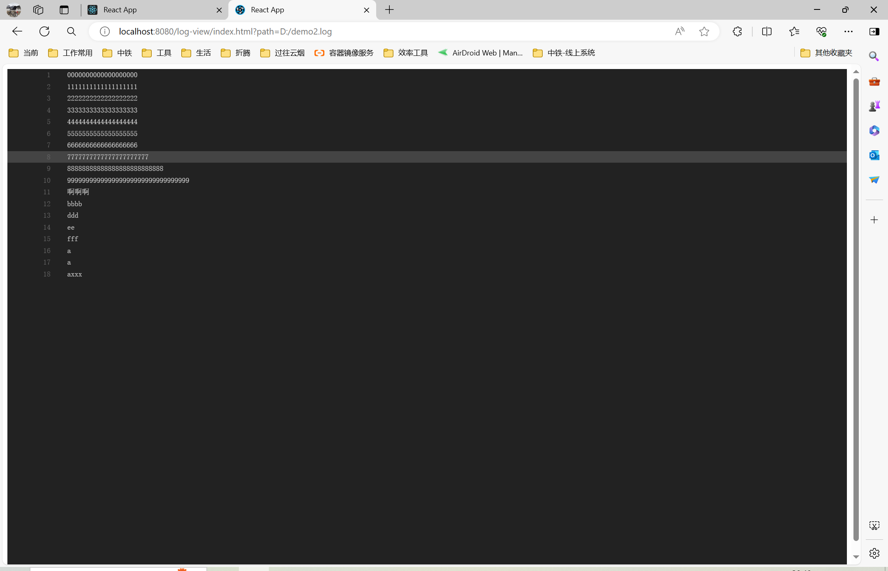

# 日志监控

日志查看服务

```yaml
log-view:
  # websocket监听文件变化的请求路径
  websocket: /api/log-view

```

## 接口

项目启动，访问http://localhost:8080/log-view/demo.html

## websocket接口

一个session对应一个监控线程，session断开线程关闭

请求格式

```
ws://127.0.0.1:8080/api/log?path=要实时监控的文件路径
```


## 使用
可参考demo.html，自行实现前端代码

### 如果简单使用，可在页面中嵌入 iframe

例如 http://127.0.0.1:8080/log-view/index.html?path=D:/demo.log





### 如果使用React，可以使用 https://github.com/mozilla-frontend-infra/react-lazylog

```
import React from 'react';
import { render } from 'react-dom';
import { LazyLog, ScrollFollow } from 'react-lazylog';

render((
  <ScrollFollow
    startFollowing={true}
    render={({ follow, onScroll }) => (
      <LazyLog url="http://127.0.0.1/api/log?path=D:\demo.log" stream follow={follow} onScroll={onScroll} />
    )}
  />
), document.getElementById('root'));

```


